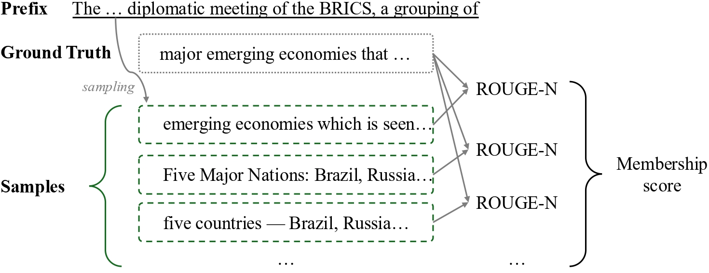
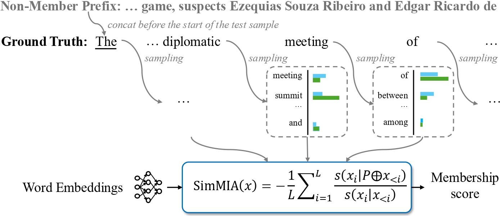
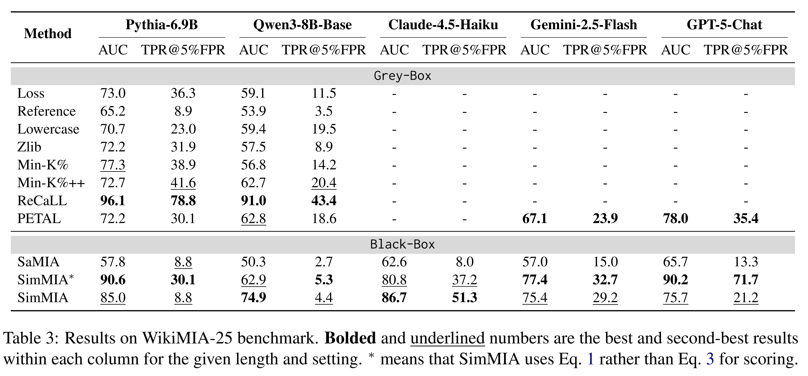

# Membership Inference on LLMs in the Wild

[](https://arxiv.org/abs/2601.11314)
[](https://huggingface.co/datasets/SimMIA/WikiMIA-25)
[](https://simmia2026.github.io/)
[](https://opensource.org/licenses/MIT)

This is the official repository of the paper "*Membership Inference on LLMs in the Wild*".

> Membership Inference Attacks (MIAs) act as a crucial auditing tool for the opaque training data of Large Language Models (LLMs). However, existing techniques predominantly rely on inaccessible model internals (e.g., logits) or suffer from poor generalization across domains in strict black-box settings where only generated text is available. In this work, we propose **SimMIA**, a robust MIA framework tailored for this text-only regime by leveraging an advanced sampling strategy and scoring mechanism. Furthermore, we present [**WikiMIA-25**](https://huggingface.co/datasets/SimMIA/WikiMIA-25), a new benchmark curated to evaluate MIA performance on modern proprietary LLMs. Experiments demonstrate that SimMIA achieves state-of-the-art results in the black-box setting, rivaling baselines that exploit internal model information.

## 🔔 Updates

- **[2026-01-19]** 🔥 We release the code of our paper. The detailed instructions can be found below.

## ✨ Overview

<table width="100%">
  <tr>
    <td width="52.6%" align="center" valign="top">
      
      <figcaption align="center">SaMIA</figcaption>
    </td>
    <td width="47%" align="center" valign="top">
      
      <figcaption align="center">SimMIA</figcaption>
    </td>
  </tr>
</table>

Compared to [SaMIA](https://aclanthology.org/2025.findings-acl.465/), a representative black-box MIA baseline, SimMIA advances it by:
1. *Word-by-Word Sampling*: SimMIA samples the immediate next word for every possible prefix rather than a complete continuation for a fixed-length prefix.
2. *Semantic Scoring*: SimMIA relies on soft embedding-based similarity to score each word rather than surface-form exact matching.
3. *Relative Aggregation*: SimMIA computes the relative ratio between scores perturbed by non-members and unperturbed scores.

## 🚀 Main Results Highlights
- **WikiMIA**: SOTA black-box MIA, improving AUC by +16.6 over prior black-box baselines and even surpassing the best gray-box method on some models (e.g., OPT-6.7B).
  <details>
  <summary>Detailed WikiMIA results.</summary>
  <p align="center">
    
  </p>
  </details>

- **MIMIR**: +14.9 AUC over previous SOTA black-box performance, trailing the best gray-box methods by only 3.4 AUC points on average.
  <details>
  <summary>Detailed MIMIR results.</summary>
  <p align="center">
    
  </p>
  </details>

- **WikiMIA-25**: generalizes to both legacy and latest (including proprietary) LLMs, outperforming the best black-box baseline by +21.7 AUC and +25.8 TPR@5%FPR.
  <details>
  <summary>Detailed WikiMIA-25 results.</summary>
  <p align="center">
    
  </p>
  </details>

## 🛠️ Installation

Our implementation is based on `python=3.12`. Follow the commands below to prepare the Python environment (we recommend using [Miniconda](https://docs.anaconda.com/miniconda/) to setup the environment):

```bash
# git clone this repository
git clone https://github.com/simmia2026/SimMIA.git
cd simmia

# install dependencies
conda create -n simmia python=3.12
conda activate simmia
pip install -e .

# Manully download the nltk tokenizer
python -c "import nltk; nltk.download('punkt'); nltk.download('punkt_tab')"
python -c "import nltk; nltk.data.find('tokenizers/punkt'); nltk.data.find('tokenizers/punkt_tab/english'); print('NLTK tokenizer data OK')"

# when torch version is not compatble with CUDA
python -c "import torch; print('torch:', torch.version); print('torch cuda:', torch.version.cuda); print('cuda available:', torch.cuda.is_available())"
pip uninstall -y torch torchvision torchaudio
pip install torch torchvision torchaudio --index-url https://download.pytorch.org/whl/cu124

```

If you want to experiment with closed-source LLM APIs, please run `pip install -e .[api]`.

## 💡 Preparation

Before testing closed-source LLMs, export your API keys into the environment first:

```bash
export OPENAI_API_KEY="your-actual-api-key-here"
export GOOGLE_API_KEY="your-actual-api-key-here"
export ANTHROPIC_API_KEY="your-actual-api-key-here"
```

## 🎯 Usage

### ⏬ Open-Source Models

Here is an example of testing SimMIA in Pythia-6.9B with WikiMIA-25 (8 GPUs):

```bash
simmia.benchmark
  --gpu_ids 0 1 2 3 4 5 6 7
  --model_name_or_path EleutherAI/pythia-6.9b
  --sampling relative_word_by_word
  --postprocess process_relative_word_data
  --inference relative_semantic_ratio
  --output_dir simmia_out
  --num_samples 100
  --data SimMIA/WikiMIA-25
  --sub_dataset paper_subset
  --num_shots 7
  --prefix_ratio 0.0
  --top_k 20
```

Key Argument Explanations:
- `--sampling`: the way to sample continuations from LLMs. You can perform either word-by-word sampling like SimMIA or complete continuation from a fixed-length prefix like SaMIA.
- `--postprocess`: some necessary data preparation, especially for SimMIA.
- `--inference`: which method is used to compute the membership score.

> [!NOTE]
> If you want to switch to SaMIA:
> - Use `--sampling generate_all_remaining`
> - Set `--inference rouge_n`
> - Set `--prefix_ratio` to a value strictly between 0 and 1 (e.g., `--prefix_ratio 0.5`)

### 🌐 Closed-Source Models

To experiment with closed-source model APIs, simply add `--concurrency` to control the maximum number of parallel API requests, and prefix the API-based model name with `api:`. Here is an example that modifies the previous example to test Gemini 2.5 Flash:

```bash
simmia.benchmark
  --concurrency 5
  --gpu_ids 0 1 2 3 4 5 6 7
  --model_name_or_path api:google/gemini-2.5-flash
  ...  # others remain the same as the above
```

> [!NOTE]
> Although calling closed-source LLM APIs does not require any GPU resources, our implementation relies on `--gpu_ids` to decide the number of parallel computation-intensive works. In this case, `--gpu_ids` must be set as SimMIA needs to run dense retrievers to calculate word similarity. If you really do not have any GPUs, please set `export CUDA_VISIBLE_DEVICES=""` and `--gpu_ids 0` to run dense retrievers on CPU.

> [!WARNING]
> Currently, we only support models from OpenAI (`api:openai/*`), Anthropic (`api:anthropic/*`), and Google (`api:google/*`).

## 📊 Reproducing Paper Results

We provide scripts to reproduce the results of SaMIA, SimMIA*, and SimMIA reported in the paper.

```bash
cd simmia

# SaMIA
bash scripts/run_samia.sh <MODEL NAME OR PATH> <DATA> <SUB_DATASET> [GPU_IDS] [CONCURRENCY]

# SimMIA*
bash scripts/run_simmia_hard.sh <MODEL NAME OR PATH> <DATA> <SUB_DATASET> [GPU_IDS] [CONCURRENCY]

# SimMIA
bash scripts/run_simmia_soft.sh <MODEL NAME OR PATH> <DATA> <SUB_DATASET> [GPU_IDS] [CONCURRENCY]
```

Valid `SUB_DATASET` values for different `DATA`:
- For `swj0419/WikiMIA`: `WikiMIA_length32`, `WikiMIA_length64`, `WikiMIA_length128`, `WikiMIA_length256` (or just `32`, `64`, `128`, `256`)
- For `SimMIA/WikiMIA-25`: `WikiMIA_length32`, `WikiMIA_length64`, `WikiMIA_length128`, `paper_subset` (or just `32`, `64`, `128` for length values)
- For `iamgroot42/mimir`: `wikipedia_(en)`, `github`, `pile_cc`, `pubmed_central`, `arxiv`, `dm_mathematics`, `hackernews`

> [!NOTE]
> For SimMIA with `dm_mathematics` in MIMIR, the `--exact_match_number` flag is automatically enabled to use exact numeric matching instead of word similarity for numerical values.

Run the following bash commmands to store the cache for sampling records.
```
# RUN the MIMIR
RUN_WIKIMIA=0 RUN_MIMIR=1 RUN_WIKIMIA25=0 RUN_API=0 \
MIMIR_MODELS="EleutherAI/pythia-160m EleutherAI/pythia-1.4b EleutherAI/pythia-2.8b EleutherAI/pythia-6.9b" \
MIMIR_SUBSETS="wikipedia_(en) github pile_cc pubmed_central arxiv dm_mathematics hackernews" \
nohup bash scripts/run_paper_simmia_cache_queue.sh \
  "0 1 2 3 4 5 6 7" "" \
  --prefix_len 50 \
  --params sampling_batch_size:100 \
  > logs/simmia_cache_queue.mimir_wikimia25_prefix50_bs100.nohup.log 2>&1 &

% RUN the WikiMIA-25
RUN_WIKIMIA=0 RUN_MIMIR=0 RUN_WIKIMIA25=1 RUN_API=0 \
WIKIMIA25_MODELS="EleutherAI/pythia-6.9b Qwen/Qwen3-8B-Base" \
WIKIMIA25_SUBSETS="paper_subset" \
nohup bash scripts/run_paper_simmia_cache_queue.sh \
  "0 1 2 3 4 5 6 7" "" \
  --params sampling_batch_size:100 \
  > logs/simmia_cache_queue.wikimia25_pythia69b_qwen3_8b_bs100.nohup.log 2>&1 &


RUN_WIKIMIA=1 RUN_MIMIR=0 RUN_WIKIMIA25=0 \
WIKIMIA_MODELS="EleutherAI/gpt-neox-20b" \
WIKIMIA_LENGTHS="32 64" \
nohup bash scripts/run_paper_simmia_cache_queue.sh \
  "0 1 2 3 4 5 6 7" "" \
  --params sampling_batch_size:2 \
  > logs/simmia_cache_queue.gptneox20b_wikimia_32_64_bs2.nohup.log 2>&1 &

RUN_WIKIMIA=1 RUN_MIMIR=0 RUN_WIKIMIA25=0 \
WIKIMIA_MODELS="EleutherAI/gpt-neox-20b" \
WIKIMIA_LENGTHS="128" \
nohup bash scripts/run_paper_simmia_cache_queue.sh \
  "0 1 2 3 4 5 6 7" "" \
  --params sampling_batch_size:1 \
  > logs/simmia_cache_queue.gptneox20b_wikimia_128_bs1.nohup.log 2>&1 &
```

To reproduce the results of most **gray-box** MIAs (e.g., Loss/Reference/Zlib/Neighborhood/Min-K%/Min-K%++/ReCaLL) reported in the paper, please refer to the official **[MIMIR](https://github.com/iamgroot42/mimir)** repo.

> [!NOTE]
> MIMIR has its own data format. To run gray-box baselines on **WikiMIA / WikiMIA-25**, you need to convert datasets into MIMIR's expected format.

To reproduce the result of **[PETAL](https://www.usenix.org/conference/usenixsecurity25/presentation/he-yu)**, please refer to the official [artifacts](https://zenodo.org/records/14725819).

> [!NOTE]
> The official PETAL implementation evaluates the result on the MIMIR subset by default. If you want to reproduce our full MIMIR result, you need to load the complete dataset.

## ✒️ Citation

Please cite our paper if you find our work useful:

```bibtex
@misc{yi2026membership,
      title={Membership Inference on LLMs in the Wild}, 
      author={Jiatong Yi and Yanyang Li},
      year={2026},
      eprint={2601.11314},
      archivePrefix={arXiv},
      primaryClass={cs.CL},
      url={https://arxiv.org/abs/2601.11314}, 
}
```
